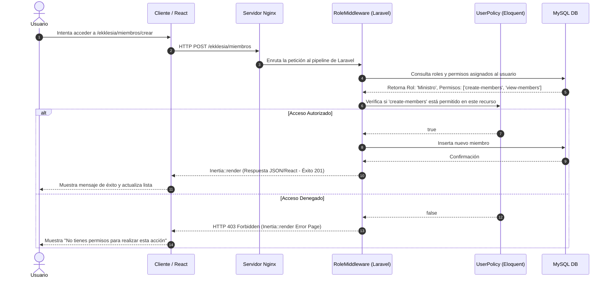

# NexusFlow OS - Especificación de Arquitectura de Software
## Autor: Arquitecto de Software Senior y Especialista en Cloud

Este documento describe la arquitectura de software, la organización del repositorio y el diseño del sistema de control de acceso para **NexusFlow**, la plataforma integral de servicios de automatización, IA e iglesias.

---

## 1. Patrón Arquitectónico e Integración Tecnológica

Para **NexusFlow**, se implementa un **Monolito Híbrido** utilizando **Laravel 11** en el backend y **React 18 (TypeScript) + Tailwind CSS** en el frontend, acoplados de forma transparente mediante **Inertia.js**. 

### Flujo de Datos y Componentes del Sistema

El siguiente diagrama detalla cómo fluyen las peticiones de los usuarios, cómo se integran los servicios de IA y automatización (n8n, Python) y cómo se procesan las tareas asíncronas mediante colas (Redis):

```mermaid
graph TD
    %% Clientes y Usuarios
    User([Usuario / Navegador]) -->|HTTPS (React + Inertia)| Nginx[Nginx Proxy Inverso]
    
    %% Servidor Web y App
    Nginx -->|Proxy Pass| PHP[PHP 8.3 FPM / Laravel 11]
    
    %% Controladores y Lógica
    subgraph Laravel Application [Backend: Laravel 11 Core]
        Auth[Módulo de Seguridad & RBAC] --> AuthCtrl[Controllers / Inertia Responses]
        AuthCtrl --> Modules[Estructura Modular]
        
        subgraph Modulos [Módulos del Dominio]
            AutomationMod[Módulo Core: Servicios Automatización / IA]
            ChurchMod[Módulo Ekklesia: Gestión Iglesias / Carrera Bíblica]
        end
        
        Modules --> AutomationMod
        Modules --> ChurchMod
    end
    
    %% Cache y Colas
    PHP -->|Cache / Sessions / Queues| Redis[(Redis Broker)]
    Redis -->|Laravel Queue Workers| QueueWorker[Procesadores de Colas]
    
    %% Base de Datos
    PHP -->|Eloquent ORM| MySQL[(MySQL 8.0 DB)]
    QueueWorker -->|Updates| MySQL
    
    %% Integración con n8n y Python
    subgraph Automatizacion e IA [Entorno de Automatización]
        n8n[Servidor n8n] -->|Webhooks / API HTTPS| PHP
        PHP -->|HTTP Request / Webhook Trigger| n8n
        n8n -->|Executes| Python[Contenedor Python ETL / Pandas]
        Python -->|Cleaned Data| MySQL
    end

    classDef primary fill:#4F46E5,stroke:#312E81,stroke-width:2px,color:#fff;
    classDef secondary fill:#0EA5E9,stroke:#0369A1,stroke-width:2px,color:#fff;
    classDef database fill:#10B981,stroke:#065F46,stroke-width:2px,color:#fff;
    classDef external fill:#F59E0B,stroke:#B45309,stroke-width:2px,color:#fff;
    
    class User,Nginx,PHP,QueueWorker primary;
    class Auth,AuthCtrl,Modules,AutomationMod,ChurchMod secondary;
    class MySQL,Redis database;
    class n8n,Python external;
```

---

## 2. Estructura de Directorios del Proyecto

El repositorio está estructurado bajo las mejores prácticas de Laravel 11 e Inertia.js. Para evitar el "código espagueti" y facilitar el mantenimiento de dos negocios muy distintos (Servicios B2B de Automatización y el SaaS de Iglesias), organizamos el backend siguiendo un enfoque **Modular Orientado al Dominio** dentro de `app/Modules`.

```text
nexusflow/
├── app/                        # Backend: Directorio principal de Laravel
│   ├── Console/                # Comandos programados de Artisan
│   ├── Http/                   # Capa de transporte HTTP
│   │   ├── Controllers/        # Controladores genéricos e Inertia
│   │   ├── Middleware/         # Controladores de seguridad, CORS, roles, etc.
│   │   └── Requests/           # Validaciones de formularios e inputs
│   ├── Models/                 # Modelos del Core (User, AuditLog, etc.)
│   ├── Modules/                # Arquitectura Modular del Negocio
│   │   ├── Automation/         # Dominio de Automatización e IA
│   │   │   ├── Controllers/    # Controladores de Servicios ETL e IA
│   │   │   ├── Models/         # Modelos (Service, PipelineRun, AgentConfig)
│   │   │   └── Services/       # Lógica pura de negocio y llamadas a Python/n8n
│   │   └── Ekklesia/           # Dominio de Iglesias (Ekklesia OS)
│   │       ├── Controllers/    # Controladores de Miembros, Crecimiento, Tareas
│   │       ├── Models/         # Modelos (Member, SpiritualGrowth, Task, Course)
│   │       └── Services/       # Lógica de la Carrera Bíblica y Asignaciones
│   └── Providers/              # Proveedores de servicios del framework
├── bootstrap/                  # Configuración de inicialización de la app
├── config/                     # Archivos de configuración (app, db, redis, mail, etc.)
├── database/                   # Migraciones y factorías de la base de datos
│   ├── factories/              # Generadores de datos falsos para tests
│   ├── migrations/             # Migraciones del Core y Módulos
│   └── seeders/                # Sembradores de datos iniciales y roles
├── docker/                     # Configuraciones de contenedores por servicio
│   ├── nginx/                  # Archivo de configuración de Nginx (default.conf)
│   └── php/                    # Configuraciones custom de PHP (local.ini)
├── python/                     # Scripts y entornos de Inteligencia Artificial & ETL
│   ├── etl_scripts/            # Scripts de limpieza de datos con Pandas
│   ├── requirements.txt        # Dependencias de Python
│   └── venv/                   # Entorno virtual local (ignorado en git)
├── resources/                  # Frontend: Vistas y assets
│   ├── css/                    # Hoja de estilos principal (Tailwind)
│   │   └── app.css
│   ├── js/                     # Componentes e interfaces de React + Inertia
│   │   ├── Components/         # Componentes UI reutilizables (Buttons, Modals)
│   │   ├── Layouts/            # Diseños de página base (DashboardLayout, ChurchLayout)
│   │   ├── Pages/              # Vistas de React representadas por Inertia
│   │   │   ├── Auth/           # Login, Registro, Recuperar Contraseña
│   │   │   ├── Automation/     # Panel de Automatizaciones, Agentes y ETL
│   │   │   └── Ekklesia/       # Registro de Miembros, Carrera Bíblica, Tareas
│   │   └── app.tsx             # Inicializador de React + Inertia + TypeScript
│   └── views/                  # Plantilla Blade raíz (app.blade.php)
├── routes/                     # Rutas de la aplicación
│   ├── api.php                 # Rutas API públicas e integraciones (n8n Webhooks)
│   ├── web.php                 # Rutas de interfaz web protegidas
│   └── console.php             # Rutas de comandos de consola
├── storage/                    # Logs, sesiones, subidas y cachés locales
├── tests/                      # Pruebas automatizadas (Unitarias y de Integración)
├── .env.example                # Plantilla de variables de entorno
├── docker-compose.yml          # Orquestador local de servicios Docker
├── Dockerfile                  # Configuración de compilación de la imagen de producción
├── package.json                # Dependencias de Node.js y compilador Vite
├── postcss.config.js           # Configuración de PostCSS para Tailwind
├── tailwind.config.js          # Configuración del Design System de Tailwind CSS
├── tsconfig.json               # Configuración de TypeScript
└── vite.config.js              # Configuración de Vite para compilar assets React
```

---

## 3. Matriz de Seguridad y Roles (RBAC - Role-Based Access Control)

Para garantizar la máxima seguridad, implementaremos un esquema de **Roles y Permisos** con asignación estricta a nivel de Base de Datos y validación en Middleware. El sistema cuenta con 4 roles principales:

| Rol | Descripción del Acceso | Alcance del Módulo |
| :--- | :--- | :--- |
| **Super Administrador** | Acceso total e ilimitado al sistema global. | Todos los dominios: Configuración de Servidores, Clientes, Iglesias y Configuraciones Core. |
| **Cliente Corporativo** | Representa al cliente de la empresa de automatización. | Acceso exclusivo al **Panel de Automatización**: Contratar servicios, ver logs de ETL, interactuar con sus agentes de IA asignados, ver facturación. |
| **Ministro / Pastor** | Gestor administrativo y espiritual de una congregación en particular. | Acceso al **Módulo Ekklesia**: Ver miembros, asignar tareas, evaluar el progreso de la carrera bíblica de los miembros a su cargo. |
| **Miembro / Servidor** | Usuario final de la iglesia (opcional). | Acceso limitado: Ver su propio progreso en la carrera bíblica, subir constancias de tareas asignadas y actualizar su información personal. |

### Flujo de Validación de Permisos (Middleware de Laravel)



### Implementación Técnica del Middleware de Control de Roles

A nivel de código Laravel, las peticiones HTTP se filtran mediante un middleware dedicado. A continuación se detalla cómo se gestiona y valida esto sin alterar el código de manera intrusiva:

```php
// app/Http/Middleware/CheckRole.php
namespace App\Http\Middleware;

use Closure;
use Illuminate\Http\Request;
use Symfony\Component\HttpFoundation\Response;

class CheckRole
{
    /**
     * Valida que el usuario autenticado cuente con alguno de los roles permitidos.
     */
    public function handle(Request $request, Closure $next, ...$roles): Response
    {
        if (!$request->user()) {
            return redirect()->route('login');
        }

        // Si es SuperAdmin, tiene paso libre por defecto
        if ($request->user()->hasRole('super-admin')) {
            return $next($request);
        }

        foreach ($roles as $role) {
            if ($request->user()->hasRole($role)) {
                return $next($request);
            }
        }

        // Si no cumple el rol, se retorna un error HTTP 403
        abort(403, 'No posees los privilegios requeridos para acceder a esta sección.');
    }
}
```

En las rutas (`routes/web.php`), los endpoints se protegen agrupándolos dentro de este middleware:

```php
Route::middleware(['auth', 'verified'])->group(function () {
    // Grupo del Módulo de Automatización para Clientes y Administradores
    Route::middleware(['role:cliente,super-admin'])->prefix('automation')->group(function () {
        Route::get('/dashboard', [AutomationDashboardController::class, 'index'])->name('automation.dashboard');
        Route::get('/pipelines', [PipelineController::class, 'index'])->name('automation.pipelines');
    });

    // Grupo del Módulo Ekklesia para Ministros y Administradores
    Route::middleware(['role:ministro,super-admin'])->prefix('ekklesia')->group(function () {
        Route::get('/dashboard', [ChurchDashboardController::class, 'index'])->name('ekklesia.dashboard');
        Route::resource('members', MemberController::class);
        Route::resource('tasks', MinisterTaskController::class);
    });
});
```

---

## 4. Revisión de Código y Posibles Mejoras (Requerimiento de Usuario)

Analizando esta arquitectura, destacamos las siguientes **oportunidades de mejora** que el equipo de desarrollo puede implementar a medida que el proyecto crezca:

1. **Multitenancy para el Módulo de Iglesias:** Si planeas vender este sistema a *múltiples* iglesias diferentes en el futuro, sugerimos implementar un esquema de base de datos Multi-inquilino (Multitenancy). Utilizando un paquete como `spatie/laravel-multitenancy`, cada iglesia puede tener su propia base de datos aislada, o bien compartir la base de datos utilizando una clave `tenant_id` en todas las tablas clave para filtrar automáticamente las consultas.
2. **Capa de Abstracción en Python:** En lugar de lanzar scripts de Python utilizando `shell_exec` de PHP (que consume memoria del servidor FPM y puede congelar peticiones HTTP si el script tarda mucho), es óptimo exponer los scripts de limpieza y agentes de IA a través de una API ligera construida con **FastAPI** ejecutándose en su propio contenedor. Laravel o n8n se comunicarán con FastAPI mediante peticiones HTTP asíncronas seguras.
3. **Optimización con Redis:** Implementar colas de Redis para todas las notificaciones (ej. correos de tareas asignadas a ministros, alertas de ETL fallidos) y utilizar Redis como caché para la carrera bíblica de los miembros, reduciendo la carga de consultas complejas en MySQL.
