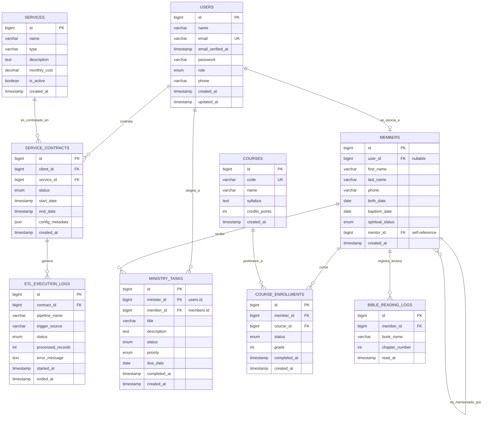

# AIAIntelligence OS - Modelo de Base de Datos Relacional (ERD & DDL)
## Módulo Core (Servicios de Automatización/IA)

Este documento especifica la arquitectura física y lógica de la base de datos MySQL 8.0 para la plataforma **AIAIntelligence**. Incluye diagramas de relaciones, la descripción de campos clave, índices y el script SQL DDL ejecutable.

---

## 1. Diagrama Entidad-Relación (ERD)

El sistema separa lógicamente el core de servicios del negocio y el módulo de iglesias (**Ekklesia**), manteniendo la integridad referencial a través de la tabla central de usuarios (`users`).



---

## 2. Script SQL DDL Ejecutable (MySQL 8.0)

A continuación se presenta el script SQL completo para construir la base de datos desde cero. Incluye tipos de datos optimizados, restricciones de claves primarias, foráneas, campos de auditoría estándar y optimizaciones mediante índices.

```sql
-- =============================================================================
-- BASE DE DATOS NEXUSFLOW OS
-- SISTEMA INTEGRADO DE SERVICIOS DE AUTOMATIZACIÓN E IGLESIAS (EKKLESIA)
-- =============================================================================

CREATE DATABASE IF NOT EXISTS nexusflow_db CHARACTER SET utf8mb4 COLLATE utf8mb4_unicode_ci;
USE nexusflow_db;

-- Desactivar temporalmente revisión de claves foráneas para evitar conflictos en creación
SET FOREIGN_KEY_CHECKS = 0;

-- -----------------------------------------------------------------------------
-- 1. TABLA CORE: USERS
-- Soporta Administradores, Clientes (Empresas), Ministros (Pastores)
-- -----------------------------------------------------------------------------
DROP TABLE IF EXISTS users;
CREATE TABLE users (
    id BIGINT UNSIGNED AUTO_INCREMENT PRIMARY KEY,
    name VARCHAR(255) NOT NULL,
    email VARCHAR(255) NOT NULL UNIQUE,
    email_verified_at TIMESTAMP NULL DEFAULT NULL,
    password VARCHAR(255) NOT NULL,
    role ENUM('super-admin', 'cliente', 'ministro', 'miembro') NOT NULL DEFAULT 'miembro',
    phone VARCHAR(50) NULL,
    remember_token VARCHAR(100) NULL,
    created_at TIMESTAMP NULL DEFAULT CURRENT_TIMESTAMP,
    updated_at TIMESTAMP NULL DEFAULT CURRENT_TIMESTAMP ON UPDATE CURRENT_TIMESTAMP,
    INDEX idx_user_role (role),
    INDEX idx_user_email (email)
) ENGINE=InnoDB DEFAULT CHARSET=utf8mb4 COLLATE=utf8mb4_unicode_ci;

-- -----------------------------------------------------------------------------
-- 2. TABLA CORE: SERVICES
-- Catálogo de servicios B2B de Automatización, ETL e IA
-- -----------------------------------------------------------------------------
DROP TABLE IF EXISTS services;
CREATE TABLE services (
    id BIGINT UNSIGNED AUTO_INCREMENT PRIMARY KEY,
    name VARCHAR(255) NOT NULL,
    type VARCHAR(100) NOT NULL COMMENT 'ETL, DataCleaning, AIAgent, IntegracionN8N',
    description TEXT NULL,
    monthly_cost DECIMAL(10, 2) NOT NULL DEFAULT 0.00,
    is_active TINYINT(1) NOT NULL DEFAULT 1,
    created_at TIMESTAMP NULL DEFAULT CURRENT_TIMESTAMP,
    updated_at TIMESTAMP NULL DEFAULT CURRENT_TIMESTAMP ON UPDATE CURRENT_TIMESTAMP,
    INDEX idx_services_active (is_active)
) ENGINE=InnoDB DEFAULT CHARSET=utf8mb4 COLLATE=utf8mb4_unicode_ci;

-- -----------------------------------------------------------------------------
-- 3. TABLA CORE: SERVICE_CONTRACTS
-- Contratos de servicios firmados por clientes empresariales
-- -----------------------------------------------------------------------------
DROP TABLE IF EXISTS service_contracts;
CREATE TABLE service_contracts (
    id BIGINT UNSIGNED AUTO_INCREMENT PRIMARY KEY,
    client_id BIGINT UNSIGNED NOT NULL,
    service_id BIGINT UNSIGNED NOT NULL,
    status ENUM('active', 'paused', 'terminated') NOT NULL DEFAULT 'active',
    start_date DATE NOT NULL,
    end_date DATE NULL,
    config_metadata JSON NULL COMMENT 'Parámetros de conexión de n8n, credenciales cifradas, etc.',
    created_at TIMESTAMP NULL DEFAULT CURRENT_TIMESTAMP,
    updated_at TIMESTAMP NULL DEFAULT CURRENT_TIMESTAMP ON UPDATE CURRENT_TIMESTAMP,
    CONSTRAINT fk_contracts_client FOREIGN KEY (client_id) REFERENCES users (id) ON DELETE CASCADE,
    CONSTRAINT fk_contracts_service FOREIGN KEY (service_id) REFERENCES services (id) ON DELETE RESTRICT,
    INDEX idx_contracts_status (status),
    INDEX idx_contracts_dates (start_date, end_date)
) ENGINE=InnoDB DEFAULT CHARSET=utf8mb4 COLLATE=utf8mb4_unicode_ci;

-- -----------------------------------------------------------------------------
-- 4. TABLA CORE: ETL_EXECUTION_LOGS
-- Historial detallado de ejecuciones de pipelines y flujos n8n/Python
-- -----------------------------------------------------------------------------
DROP TABLE IF EXISTS etl_execution_logs;
CREATE TABLE etl_execution_logs (
    id BIGINT UNSIGNED AUTO_INCREMENT PRIMARY KEY,
    contract_id BIGINT UNSIGNED NOT NULL,
    pipeline_name VARCHAR(255) NOT NULL COMMENT 'Identificador del flujo en n8n',
    trigger_source VARCHAR(100) NOT NULL COMMENT 'n8n_webhook, manual, cron',
    status ENUM('success', 'failed', 'running') NOT NULL DEFAULT 'running',
    processed_records INT UNSIGNED DEFAULT 0,
    error_message TEXT NULL,
    started_at TIMESTAMP NULL DEFAULT CURRENT_TIMESTAMP,
    ended_at TIMESTAMP NULL DEFAULT NULL,
    CONSTRAINT fk_etl_logs_contract FOREIGN KEY (contract_id) REFERENCES service_contracts (id) ON DELETE CASCADE,
    INDEX idx_etl_logs_pipeline (pipeline_name),
    INDEX idx_etl_logs_status (status),
    INDEX idx_etl_logs_started (started_at)
) ENGINE=InnoDB DEFAULT CHARSET=utf8mb4 COLLATE=utf8mb4_unicode_ci;

-- -----------------------------------------------------------------------------
-- 5. TABLA EKKLESIA: MEMBERS
-- Registro robusto de miembros y servidores en el módulo de Iglesias
-- -----------------------------------------------------------------------------
DROP TABLE IF EXISTS members;
CREATE TABLE members (
    id BIGINT UNSIGNED AUTO_INCREMENT PRIMARY KEY,
    user_id BIGINT UNSIGNED NULL UNIQUE COMMENT 'Asociación a la cuenta de usuario para login web',
    first_name VARCHAR(150) NOT NULL,
    last_name VARCHAR(150) NOT NULL,
    phone VARCHAR(50) NULL,
    birth_date DATE NULL,
    baptism_date DATE NULL,
    spiritual_status ENUM('nuevo_convertido', 'en_discipulado', 'bautizado', 'lider', 'pastor', 'inactivo') NOT NULL DEFAULT 'nuevo_convertido',
    mentor_id BIGINT UNSIGNED NULL COMMENT 'Auto-referencia para seguimiento discipular uno-a-uno',
    created_at TIMESTAMP NULL DEFAULT CURRENT_TIMESTAMP,
    updated_at TIMESTAMP NULL DEFAULT CURRENT_TIMESTAMP ON UPDATE CURRENT_TIMESTAMP,
    CONSTRAINT fk_members_user FOREIGN KEY (user_id) REFERENCES users (id) ON DELETE SET NULL,
    CONSTRAINT fk_members_mentor FOREIGN KEY (mentor_id) REFERENCES members (id) ON DELETE SET NULL,
    INDEX idx_members_spiritual (spiritual_status),
    INDEX idx_members_names (last_name, first_name),
    UNIQUE KEY uq_member_name_phone (first_name, last_name, phone)
) ENGINE=InnoDB DEFAULT CHARSET=utf8mb4 COLLATE=utf8mb4_unicode_ci;

-- -----------------------------------------------------------------------------
-- 6. TABLA EKKLESIA: MINISTRY_TASKS
-- Tareas pastorales, ministeriales y logísticas asignadas por ministros a miembros
-- -----------------------------------------------------------------------------
DROP TABLE IF EXISTS ministry_tasks;
CREATE TABLE ministry_tasks (
    id BIGINT UNSIGNED AUTO_INCREMENT PRIMARY KEY,
    minister_id BIGINT UNSIGNED NOT NULL COMMENT 'Pastor/Ministro que asigna la tarea',
    member_id BIGINT UNSIGNED NOT NULL COMMENT 'Miembro/Servidor que ejecuta la tarea',
    title VARCHAR(255) NOT NULL,
    description TEXT NULL,
    status ENUM('pending', 'in_progress', 'completed', 'failed') NOT NULL DEFAULT 'pending',
    priority ENUM('low', 'medium', 'high', 'critical') NOT NULL DEFAULT 'medium',
    due_date DATE NOT NULL,
    completed_at TIMESTAMP NULL DEFAULT NULL,
    created_at TIMESTAMP NULL DEFAULT CURRENT_TIMESTAMP,
    updated_at TIMESTAMP NULL DEFAULT CURRENT_TIMESTAMP ON UPDATE CURRENT_TIMESTAMP,
    CONSTRAINT fk_tasks_minister FOREIGN KEY (minister_id) REFERENCES users (id) ON DELETE CASCADE,
    CONSTRAINT fk_tasks_member FOREIGN KEY (member_id) REFERENCES members (id) ON DELETE CASCADE,
    INDEX idx_tasks_status (status),
    INDEX idx_tasks_priority (priority),
    INDEX idx_tasks_due_date (due_date)
) ENGINE=InnoDB DEFAULT CHARSET=utf8mb4 COLLATE=utf8mb4_unicode_ci;

-- -----------------------------------------------------------------------------
-- 7. TABLA EKKLESIA: COURSES
-- Plan de estudio y currículum oficial de la "Carrera Bíblica"
-- -----------------------------------------------------------------------------
DROP TABLE IF EXISTS courses;
CREATE TABLE courses (
    id BIGINT UNSIGNED AUTO_INCREMENT PRIMARY KEY,
    code VARCHAR(50) NOT NULL UNIQUE COMMENT 'Ej. BIB-101, DISC-02',
    name VARCHAR(255) NOT NULL,
    syllabus TEXT NULL,
    credits_points INT UNSIGNED NOT NULL DEFAULT 10 COMMENT 'Puntos acumulables en la Carrera Bíblica',
    created_at TIMESTAMP NULL DEFAULT CURRENT_TIMESTAMP,
    updated_at TIMESTAMP NULL DEFAULT CURRENT_TIMESTAMP ON UPDATE CURRENT_TIMESTAMP,
    INDEX idx_courses_code (code)
) ENGINE=InnoDB DEFAULT CHARSET=utf8mb4 COLLATE=utf8mb4_unicode_ci;

-- -----------------------------------------------------------------------------
-- 8. TABLA EKKLESIA: COURSE_ENROLLMENTS
-- Inscripciones y calificaciones en los cursos de la Carrera Bíblica
-- -----------------------------------------------------------------------------
DROP TABLE IF EXISTS course_enrollments;
CREATE TABLE course_enrollments (
    id BIGINT UNSIGNED AUTO_INCREMENT PRIMARY KEY,
    member_id BIGINT UNSIGNED NOT NULL,
    course_id BIGINT UNSIGNED NOT NULL,
    status ENUM('enrolled', 'completed', 'failed', 'dropped') NOT NULL DEFAULT 'enrolled',
    grade INT UNSIGNED NULL COMMENT 'Puntuación final del examen o discipulado (0-100)',
    completed_at TIMESTAMP NULL DEFAULT NULL,
    created_at TIMESTAMP NULL DEFAULT CURRENT_TIMESTAMP,
    updated_at TIMESTAMP NULL DEFAULT CURRENT_TIMESTAMP ON UPDATE CURRENT_TIMESTAMP,
    CONSTRAINT fk_enrollments_member FOREIGN KEY (member_id) REFERENCES members (id) ON DELETE CASCADE,
    CONSTRAINT fk_enrollments_course FOREIGN KEY (course_id) REFERENCES courses (id) ON DELETE CASCADE,
    UNIQUE KEY uq_member_course (member_id, course_id),
    INDEX idx_enrollments_status (status)
) ENGINE=InnoDB DEFAULT CHARSET=utf8mb4 COLLATE=utf8mb4_unicode_ci;

-- -----------------------------------------------------------------------------
-- 9. TABLA EKKLESIA: BIBLE_READING_LOGS
-- Registro de progreso diario de lectura para la "Carrera Bíblica"
-- -----------------------------------------------------------------------------
DROP TABLE IF EXISTS bible_reading_logs;
CREATE TABLE bible_reading_logs (
    id BIGINT UNSIGNED AUTO_INCREMENT PRIMARY KEY,
    member_id BIGINT UNSIGNED NOT NULL,
    book_name VARCHAR(100) NOT NULL COMMENT 'Nombre del libro bíblico, ej. Genesis, Juan',
    chapter_number INT UNSIGNED NOT NULL,
    read_at TIMESTAMP NULL DEFAULT CURRENT_TIMESTAMP,
    CONSTRAINT fk_reading_member FOREIGN KEY (member_id) REFERENCES members (id) ON DELETE CASCADE,
    UNIQUE KEY uq_member_book_chapter (member_id, book_name, chapter_number),
    INDEX idx_reading_member_book (member_id, book_name),
    INDEX idx_reading_member_date (member_id, read_at)
) ENGINE=InnoDB DEFAULT CHARSET=utf8mb4 COLLATE=utf8mb4_unicode_ci;

-- Reactivar validaciones de claves foráneas
SET FOREIGN_KEY_CHECKS = 1;
```

---

## 3. Estrategias de Optimización e Integridad de Datos (Investigación del Arquitecto)

En línea con la regla del usuario sobre la **investigación de la optimización**, hemos integrado consideraciones críticas de bases de datos para garantizar el máximo rendimiento bajo tráfico pesado:

### A. Diseño Eficiente de Índices (Claves Compuestas)
- **Logística de Lectura Bíblica:** En la tabla `bible_reading_logs`, para evitar que un miembro registre dos veces el mismo capítulo del mismo libro, se implementó una **restricción única compuesta**: `uq_member_book_chapter (member_id, book_name, chapter_number)`. Además de forzar la integridad lógica, esto optimiza sustancialmente las consultas agregadas como *"Saber qué capítulos del libro de Juan ha leído el miembro X"* al proveer un índice de búsqueda indexado y ordenado en disco.
- **Búsqueda Rápida de Miembros:** En `members`, se creó un índice compuesto `idx_members_names (last_name, first_name)`. Esto acelera las búsquedas por apellidos y nombres (comunes en filtros de reportes pastorales y listados de autocompletado en frontend).
- **Historial de Lectura Bíblica:** Se incorpora el índice compuesto `idx_reading_member_date (member_id, read_at)`. Esto acelera masivamente los cálculos temporales en tableros pastorales (*"Qué miembros leyeron más capítulos esta semana o este mes"*), evitando escaneos completos de tabla (Full Table Scans) que crecerían desmedidamente con el tiempo.
- **Inserción Masiva en Discipulado (ETL Seguro):** En la tabla `members`, se añade una restricción única `uq_member_name_phone (first_name, last_name, phone)`. Esto garantiza la integridad referencial a nivel físico e impide la duplicidad de datos al importar registros por lotes desde fuentes externas como n8n y Pandas.

### B. Uso de JSON Nativo para Configuraciones Flexibles
- En la tabla `service_contracts`, el campo `config_metadata` utiliza el tipo de datos **JSON** de MySQL 8.0. Esto evita la necesidad de crear subtablas complejas ("EAV - Entity Attribute Value", que destrozan el rendimiento con JOINs recurrentes) para almacenar las variables específicas de conexión que requiere n8n o Python para cada cliente (ej. `webhook_url`, `db_host_cliente`, `api_keys`). El tipo JSON permite utilizar operadores como `->` o `JSON_EXTRACT()` de manera extremadamente veloz y segura.

### C. Normalización y Auto-referencia Discipular
- La auto-referencia en `members.mentor_id` que apunta a `members.id` representa un diseño limpio y clásico de discipulado uno-a-uno o jerárquico. Permite mapear toda la estructura piramidal o de grupos de crecimiento de la iglesia con un solo `LEFT JOIN`, reduciendo la complejidad del motor de almacenamiento InnoDB.
- El uso de la restricción `ON DELETE RESTRICT` en `service_contracts.service_id` evita desastres administrativos, impidiendo que se borre accidentalmente un servicio si hay contratos vigentes asociados a él.
