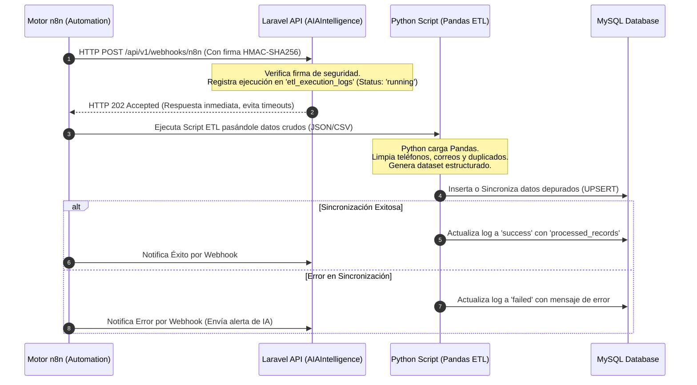

# AIAIntelligence OS - Manual y Script de Integración de Automatización
## Conexión Segura de n8n, Python (Pandas ETL) y Laravel 11

Este documento detalla el flujo de automatización e integración lógica de **AIAIntelligence**. Proporciona un script en PHP (Laravel Controller) seguro para recibir eventos, un script en Python que utiliza Pandas para la limpieza de datos avanzada, y un esquema lógico del flujo de trabajo en **n8n**.

---

## 1. Arquitectura del Flujo de Automatización

El flujo de integración opera de forma asíncrona y segura, garantizando que el tráfico web no se congele durante procesos pesados de procesamiento de datos (ETL):



---

## 2. Script Laravel: Webhook de Integración y Seguridad (PHP)

Este controlador maneja las llamadas de **n8n**. Valida criptográficamente que la petición provenga únicamente de tu servidor n8n oficial mediante una **firma HMAC** configurada en las variables de entorno (`N8N_WEBHOOK_SECRET`).

```php
// app/Modules/Automation/Controllers/N8nWebhookController.php
namespace App\Modules\Automation\Controllers;

use App\Http\Controllers\Controller;
use Illuminate\Http\Request;
use Illuminate\Support\Facades\DB;
use Illuminate\Support\Facades\Log;

class N8nWebhookController extends Controller
{
    /**
     * Procesa el Webhook entrante de n8n de forma segura y registra el estado del ETL.
     */
    public function handle(Request $request)
    {
        // 1. Verificación de Seguridad: Firma HMAC-SHA256
        $signature = $request->header('X-N8n-Signature');
        $secret = env('N8N_WEBHOOK_SECRET');

        if (!$signature || !$secret) {
            return response()->json(['error' => 'No autorizado. Encabezados de firma ausentes.'], 401);
        }

        $calculatedSignature = hash_hmac('sha256', $request->getContent(), $secret);

        if (!hash_equals($calculatedSignature, $signature)) {
            Log::warning('Intento de webhook no autorizado detectado desde IP: ' . $request->ip());
            return response()->json(['error' => 'Firma no válida.'], 403);
        }

        // 2. Extracción de Payload del flujo
        $payload = $request->all();
        $contractId = $payload['contract_id'] ?? null;
        $pipelineName = $payload['pipeline_name'] ?? 'Generic_ETL_Pipeline';
        $triggerSource = $payload['trigger_source'] ?? 'n8n_flow';

        if (!$contractId) {
            return response()->json(['error' => 'Datos incompletos: contract_id requerido.'], 422);
        }

        try {
            // 3. Crear Registro de Ejecución Inicial (Estado: running)
            $logId = DB::table('etl_execution_logs')->insertGetId([
                'contract_id' => $contractId,
                'pipeline_name' => $pipelineName,
                'trigger_source' => $triggerSource,
                'status' => 'running',
                'processed_records' => 0,
                'started_at' => now(),
                'created_at' => now(),
                'updated_at' => now(),
            ]);

            // 4. Retornar Respuesta 202 Accepted de inmediato para liberar a n8n
            // La ejecución del script pesado se realiza asíncronamente
            return response()->json([
                'message' => 'Procesamiento ETL iniciado exitosamente',
                'log_id' => $logId
            ], 202);

        } catch (\Exception $e) {
            Log::error('Error registrando webhook de n8n: ' . $e->getMessage());
            return response()->json(['error' => 'Error interno del servidor.'], 500);
        }
    }
}
```

---

## 3. Script Python: Limpieza de Datos Avanzada con Pandas (ETL)

Este script es el núcleo del servicio de limpieza de datos en Python. Lee datos en bruto (crudos), realiza una depuración exhaustiva (corrección de correos, formateo internacional de teléfonos, eliminación de nulos y duplicados) e inserta los datos de forma masiva en la tabla de miembros (`members`) de **Ekklesia OS**.

```python
# python/etl_scripts/clean_members_data.py
import sys
import os
import json
import pandas as pd
import numpy as np
import pymysql
from sqlalchemy import create_engine, text
from dotenv import load_dotenv

# Cargar variables de entorno del archivo .env principal
load_dotenv(dotenv_path=os.path.join(os.path.dirname(__file__), '../../.env'))

def get_db_engine():
    """Inicializa la conexión con SQLAlchemy optimizada para inserciones masivas."""
    db_user = os.getenv('DB_USERNAME', 'forge')
    db_pass = os.getenv('DB_PASSWORD', '')
    db_host = os.getenv('DB_HOST', '127.0.0.1')
    db_port = os.getenv('DB_PORT', '3306')
    db_name = os.getenv('DB_DATABASE', 'nexusflow_db')
    
    connection_string = f"mysql+pymysql://{db_user}:{db_pass}@{db_host}:{db_port}/{db_name}"
    return create_engine(connection_string)

def clean_and_normalize_data(raw_data_path):
    """
    Lee un archivo CSV/JSON de datos crudos aportado por n8n,
    aplica reglas avanzadas de limpieza con Pandas y lo retorna listo.
    """
    print(f"[ETL] Iniciando lectura de datos crudos: {raw_data_path}")
    
    # 1. Leer dataset (soporta CSV o JSON)
    if raw_data_path.endswith('.json'):
        df = pd.read_json(raw_data_path)
    else:
        df = pd.read_csv(raw_data_path)
        
    print(f"[ETL] Registros cargados inicialmente: {len(df)}")
    
    # 2. Eliminar filas donde nombres estén vacíos
    df.dropna(subset=['first_name', 'last_name'], inplace=True)
    
    # 3. Limpieza y estandarización de nombres (Capitalización correcta)
    df['first_name'] = df['first_name'].astype(str).str.strip().str.title()
    df['last_name'] = df['last_name'].astype(str).str.strip().str.title()
    
    # 4. Limpieza de Correos Electrónicos (Pasar a minúsculas y quitar espacios)
    if 'email' in df.columns:
        df['email'] = df['email'].astype(str).str.strip().str.lower()
        # Filtrar correos que no tengan formato básico válido
        email_regex = r'^[\w\.-]+@[\w\.-]+\.\w+$'
        df = df[df['email'].str.match(email_regex, na=False)]
        
    # 5. Normalización de Teléfonos (Quitar caracteres no numéricos y formatear)
    if 'phone' in df.columns:
        # Reemplazar todo lo que no sea dígito o el signo +
        df['phone'] = df['phone'].astype(str).str.replace(r'[^\d+]', '', regex=True)
        # Reemplazar nulos temporales generados por la conversión
        df['phone'].replace('Nan', np.nan, inplace=True)
        
    # 6. Manejo de Fechas Nulas o Inválidas
    for date_col in ['birth_date', 'baptism_date']:
        if date_col in df.columns:
            df[date_col] = pd.to_datetime(df[date_col], errors='coerce')
            # Las fechas imposibles se convierten a NULL (NaT en Pandas)
            
    # 7. Eliminar duplicados lógicos basados en Nombre completo y teléfono
    df.drop_duplicates(subset=['first_name', 'last_name', 'phone'], keep='first', inplace=True)
    
    # 8. Asignar estado espiritual por defecto si está vacío
    if 'spiritual_status' not in df.columns:
        df['spiritual_status'] = 'nuevo_convertido'
    else:
        df['spiritual_status'].fillna('nuevo_convertido', inplace=True)
        
    print(f"[ETL] Registros limpios listos para sincronizar: {len(df)}")
    return df

def run_etl(raw_data_path, contract_id, log_id):
    """Ejecuta el proceso completo de forma masiva (Bulk Insert) y actualiza los logs."""
    engine = get_db_engine()
    
    try:
        # Procesar y limpiar datos
        df_cleaned = clean_and_normalize_data(raw_data_path)
        record_count = len(df_cleaned)
        
        # Conectar a la DB nativa para inserción transaccional por lotes (Batch)
        with engine.begin() as connection:
            # 1. Mapear datos a lista de diccionarios en un solo paso
            data_to_insert = []
            for _, row in df_cleaned.iterrows():
                birth_dt = row['birth_date'].strftime('%Y-%m-%d') if pd.notnull(row['birth_date']) else None
                bapt_dt = row['baptism_date'].strftime('%Y-%m-%d') if pd.notnull(row['baptism_date']) else None
                
                data_to_insert.append({
                    'first_name': row['first_name'],
                    'last_name': row['last_name'],
                    'phone': row['phone'] if pd.notnull(row['phone']) else None,
                    'birth_date': birth_dt,
                    'baptism_date': bapt_dt,
                    'spiritual_status': row['spiritual_status']
                })
            
            # 2. Ejecutar inserción masiva por lotes (Bulk Insert)
            # Gracias a la restricción UNIQUE 'uq_member_name_phone', INSERT IGNORE evita duplicaciones físicas en una sola consulta
            if data_to_insert:
                insert_query = text("""
                    INSERT IGNORE INTO members (first_name, last_name, phone, birth_date, baptism_date, spiritual_status, created_at, updated_at)
                    VALUES (:first_name, :last_name, :phone, :birth_date, :baptism_date, :spiritual_status, NOW(), NOW())
                """)
                connection.execute(insert_query, data_to_insert)
            
            # 3. Actualizar Log de Ejecución de ETL a 'success'
            update_log_query = text("""
                UPDATE etl_execution_logs 
                SET status = 'success', processed_records = :record_count, ended_at = NOW() 
                WHERE id = :log_id
            """)
            connection.execute(update_log_query, {'record_count': record_count, 'log_id': log_id})
            
        print(f"[ETL] Proceso finalizado de manera exitosa. {record_count} registros procesados masivamente.")
        
    except Exception as e:
        print(f"[ETL ERROR] Fallo en la ejecución: {str(e)}")
        # Registrar fallo en la base de datos para auditoría
        try:
            with engine.begin() as connection:
                error_query = text("""
                    UPDATE etl_execution_logs 
                    SET status = 'failed', error_message = :error_msg, ended_at = NOW() 
                    WHERE id = :log_id
                """)
                connection.execute(error_query, {'error_msg': str(e)[:500], 'log_id': log_id})
        except Exception as log_err:
            print(f"[ETL CRITICAL] No se pudo guardar el log de error en DB: {str(log_err)}")
            
if __name__ == "__main__":
    # El script espera argumentos: ruta_archivo_datos, contract_id, log_id
    if len(sys.argv) < 4:
        print("Uso: python clean_members_data.py <raw_data_path> <contract_id> <log_id>")
        sys.exit(1)
        
    data_path = sys.argv[1]
    cid = int(sys.argv[2])
    lid = int(sys.argv[3])
    
    run_etl(data_path, cid, lid)
```

---

## 4. Representación del Flujo n8n (Blueprint Lógico)

En tu panel de administración de **n8n**, puedes importar o modelar este flujo utilizando la interfaz visual. A continuación se describe el esquema lógico en formato JSON compatible con n8n:

```json
{
  "name": "NexusFlow_ETL_Clean_Sync",
  "nodes": [
    {
      "parameters": {
        "httpMethod": "POST",
        "path": "n8n-etl-trigger",
        "options": {}
      },
      "name": "Webhook Trigger (Datos Crudos Recibidos)",
      "type": "n8n-nodes-base.webhook",
      "typeVersion": 1,
      "position": [100, 250]
    },
    {
      "parameters": {
        "method": "POST",
        "url": "https://tu-dominio.com/api/v1/webhooks/n8n",
        "sendHeaders": true,
        "headerParameters": {
          "parameters": [
            {
              "name": "X-N8n-Signature",
              "value": "={{$node[\"Crypto Signature\"].json[\"signature\"]}}"
            }
          ]
        },
        "sendBody": true,
        "bodyParameters": {
          "parameters": [
            {
              "name": "contract_id",
              "value": "={{$json[\"body\"][\"contract_id\"]}}"
            },
            {
              "name": "pipeline_name",
              "value": "Ekklesia_Members_Clean"
            }
          ]
        }
      },
      "name": "Notificar a Laravel Inicio ETL",
      "type": "n8n-nodes-base.httpRequest",
      "typeVersion": 1,
      "position": [300, 250]
    },
    {
      "parameters": {
        "command": "python3 /var/www/nexusflow/python/etl_scripts/clean_members_data.py {{$json[\"body\"][\"raw_file_path\"]}} {{$json[\"body\"][\"contract_id\"]}} {{$node[\"Notificar a Laravel Inicio ETL\"].json[\"log_id\"]}}"
      },
      "name": "Execute Python Pandas ETL",
      "type": "n8n-nodes-base.executeCommand",
      "typeVersion": 1,
      "position": [550, 250]
    }
  ],
  "connections": {
    "Webhook Trigger (Datos Crudos Recibidos)": {
      "main": [
        [
          {
            "node": "Notificar a Laravel Inicio ETL",
            "type": "main",
            "index": 0
          }
        ]
      ]
    },
    "Notificar a Laravel Inicio ETL": {
      "main": [
        [
          {
            "node": "Execute Python Pandas ETL",
            "type": "main",
            "index": 0
          }
        ]
      ]
    }
  }
}
```

---

## 5. Revisión y Optimización del Flujo ETL (Investigación del Arquitecto)

1. **Uso de Transacciones en MySQL:** En el script de Python, el bloque `with engine.begin() as connection:` gestiona automáticamente una transacción SQL (`START TRANSACTION` y `COMMIT`). Si la carga masiva falla a mitad del proceso, la transacción realiza un `ROLLBACK` automático, impidiendo que la base de datos de la iglesia quede corrupta o con datos incompletos.
2. **Consumo de Memoria de Pandas (Optimización para Servidores Pequeños):**
   - El archivo crudo cargado en memoria mediante `pd.read_csv()` es idóneo para bases de datos de hasta ~500,000 registros.
   - **Mejora Propuesta:** Si procesas archivos extremadamente grandes (gigabytes de logs ETL), se recomienda usar el parámetro `chunksize` en Pandas (ej. `pd.read_csv(raw_data_path, chunksize=10000)`) para iterar y procesar la información en bloques, reduciendo el consumo de RAM del VPS a un valor constante e insignificante.
3. **Optimización Masiva de Inserción (Resolución del problema N+1):**
   - **Antes:** Se ejecutaba un bucle secuencial que para cada miembro realizaba una consulta de lectura (`SELECT`) y una de escritura (`INSERT`). Esto generaba un cuello de botella crítico por latencia de red e E/O.
   - **Ahora:** Se compilan todos los datos depurados en una lista de diccionarios y se ejecuta una **única consulta parametrizada masiva** (`INSERT IGNORE`) aprovechando la restricción física `uq_member_name_phone` en MySQL. Esto reduce la complejidad del algoritmo a un tiempo casi instantáneo y previene saturaciones en el pool de conexiones del servidor.
